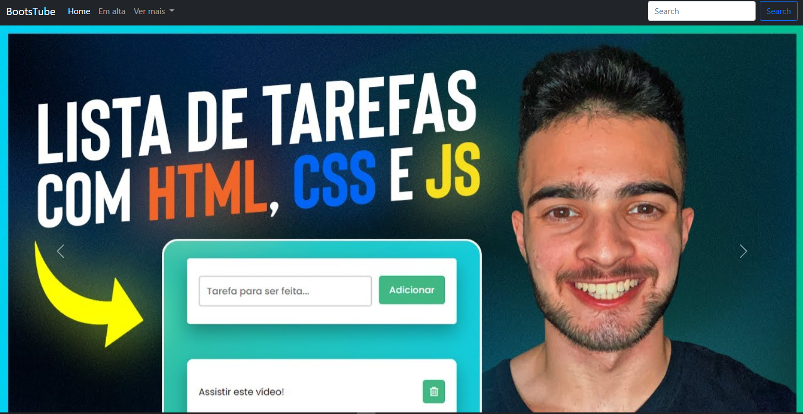

<h1 align="center">🌂 BOOTSTUBE</h1>

> 🔎 The project is called "BootsTube" and was carried out using [Bootstrap](https://getbootstrap.com) technology.

Check out the app: https://kayke-fujinaka.github.io/BootsTube/  

## :page_facing_up: Explanation

The project is called "BootsTube" and it was realized using the [Bootstrap](https://getbootstrap.com) technology. The framework used is quite effective for carrying out projects, as it makes it possible for components to be responsive and ready to use in a very easy way.

The components used were: Carousel, Navbar and Card.

## 🚀 Technologies ##

- [HTML](https://developer.mozilla.org/en-US/docs/Web/HTML)
- [Bootstrap](https://getbootstrap.com)

## 🤝 Collaborators

Thanks to the following people who contributed to this project:

<table>
  <tr>
    <td align="center">
      <a href="#">
         
        
          <b>Kayke Fujinaka</b>
        
      </a>
    </all>
  </tr>
</table>

## 📝 License

This project is under license. See the [LICENSE](LICENSE.md) file for more details.

&#xa0;

<a href="#top">Go back to top</a>
